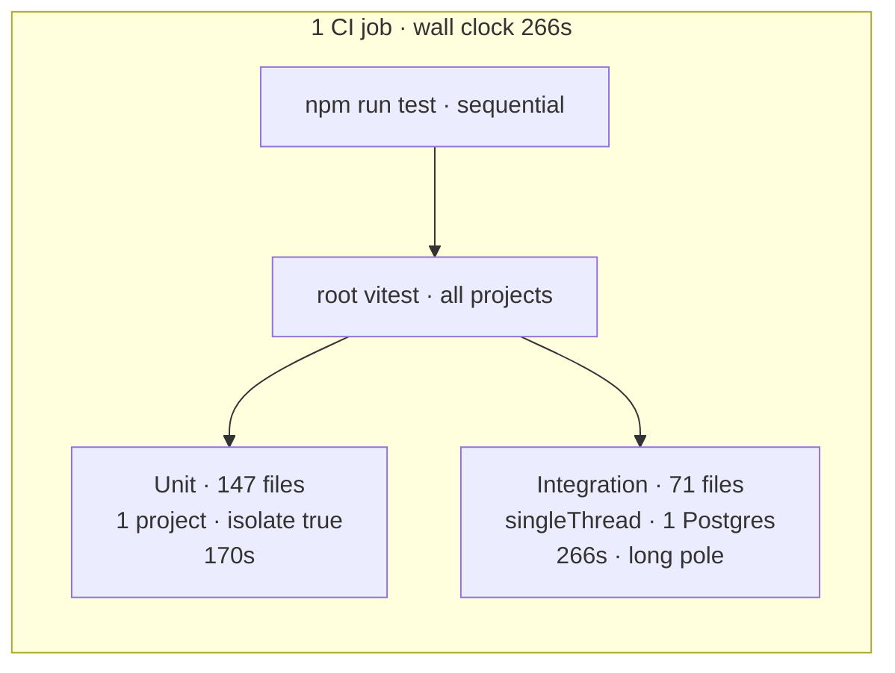
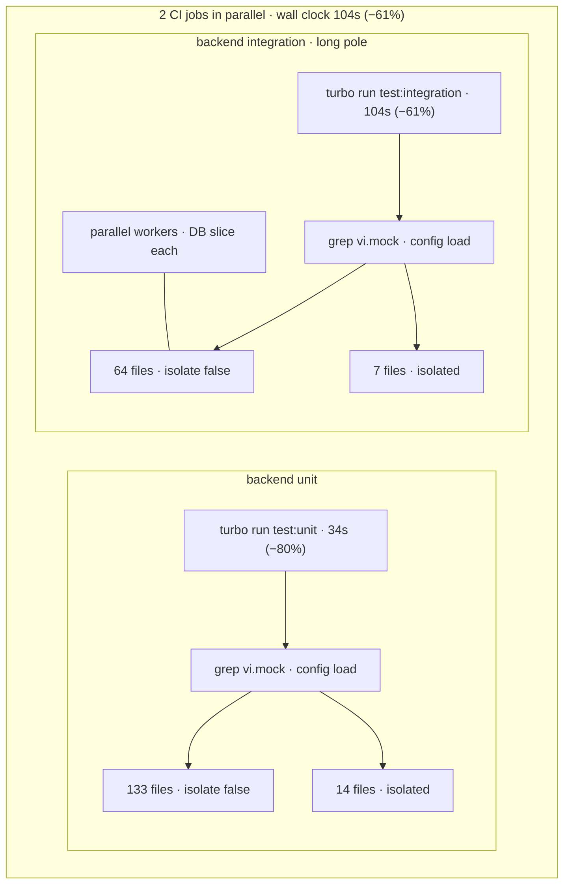

# Vitest at scale: up to 80% faster backend tests

We cut backend integration Vitest time from **266s to 104s** (−61%) and unit Vitest time from **170s to 34s** (−80%) at full stack. The tests were not wrong — we kept rebuilding module graphs and sharing databases that could not safely be shared.

Three changes, applied across both suites where they apply:

1. **Mock split** — grep for `vi.mock`, run non-mock files with `isolate: false`
2. **Worker isolation** — per-worker Postgres, Redis, and DynamoDB for integration tests
3. **SpyOn migration** — replace `vi.mock('@/…')` on our own modules with `vi.spyOn()` (same pattern for unit and integration)

Integration gains come mostly from worker isolation + mock split; spyOn widens the shared pool. Unit gains come mostly from mock split + spyOn.

---

**Summary**

| Suite | Before (develop-v2) | After (full stack) | Change |
|-------|--------|-------------------|--------|
| Backend unit (147 files) | **170s** | **34s** | **−80%** |
| Backend integration (71 files / 814 tests) | **266s** | **104s** | **−61%** |
| Wall clock (slowest suite) | **266s** | **104s** | **−61%** |

Benchmark Vitest `Duration` per suite. To compare unit and integration separately, each suite runs in its own CI job via `turbo run test:unit` or `test:integration`. On develop-v2, both ran in **one CI job** (`npm run test`) — the table below uses the split-job timing with develop-v2's Vitest config as the baseline.

Unit speedup comes in two steps:

| Stage | Duration | Isolated files |
|-------|----------|----------------|
| Baseline | 170s | 147 (all isolated) |
| Mock split only | 96s (−43%) | 65 |
| Mock split + spyOn | 34s (−80%) | 14 |

Integration at full stack: **104s** (−61%).

---

## How backend tests run

pnpm + Turbo monorepo, Vitest.

| Suite | Pattern | Infra |
|-------|---------|-------|
| Unit | `src/**/*.test.ts` | mocks only |
| Integration | `src/**/*.itest.ts` | Testcontainers: Postgres ×2, Redis, DynamoDB Local |

### Before (develop-v2)

**One CI job** runs `npm run test` — a single root Vitest invocation that includes backend unit and integration (plus frontend) back-to-back. Backend used one Vitest project per suite, with no mock split and no per-worker databases.



### After (full stack)

**Two CI jobs in parallel**, each via turbo — so unit and integration are timed independently and wall clock is the slower job (integration).



Inside each job: grep-split into shared and isolated Vitest projects. Mock split alone shares 82 unit files before spyOn shrinks the isolated bucket to 14.

One `vi.mock()` anywhere in a file sends the whole file to the isolated project. Migrating three of four mocks in a file does nothing for routing.

---

## 1. Mock split: stop paying for isolation you do not need

**Applies to:** unit and integration.

Before (develop-v2): one Vitest project per suite, default `isolate: true`. Every file got a fresh module graph — expensive when ~147 unit files each import most of the backend tree.

After: at config load, grep for `vi.mock` and split into two projects. Files without mocks run with `pool: threads`, `isolate: false`. Files with `vi.mock()` stay isolated so replacements do not leak across tests.

| Suite | Shared | Isolated |
|-------|--------|----------|
| Unit (split only) | 82 | 65 |
| Unit (+ spyOn) | 133 | 14 |
| Integration (+ spyOn) | 64 | 7 |

Also on unit: `maxWorkers: cpus().length`.

Mock split alone moved 82 unit files to shared workers (−43% on unit time).

---

## 2. Worker isolation: parallel integration without flakiness

**Applies to:** integration only.

Before (develop-v2): `singleThread: true`, four sequential `globalSetup` files, one shared Postgres, table-by-table truncate on every test.

After: each worker gets its own slice via `test/helpers/worker-isolation.ts`:

| Resource | Per worker |
|----------|------------|
| Postgres | `plumber_test_w{N}` |
| Tiles Postgres | `tiles_test_w{N}` |
| Redis | 4 logical DBs from `REDIS_DB_OFFSET = N × 4` |
| DynamoDB | table suffix `w{N}` |

Containers boot once in `test/global-setup.ts` (`@opengovsg/testcontainers`). `beforeEach` seeds Postgres and flushes Redis. `afterEach` runs batched `TRUNCATE CASCADE` and wipes DynamoDB. `hookTimeout: 120_000` — wiping 10k tile rows after a large itest exceeded Vitest's default 10s hook limit.

`maxWorkers = min(cpus, 32)` (Redis slot cap).

This is most of the integration win. Integration was the wall-clock long pole before and after (**266s → 104s**, −61%).

---

## 3. SpyOn: shrink the isolated bucket

**Applies to:** unit and integration.

`vi.mock('@/…')` on internal code forces a file into the isolated project even when `vi.spyOn()` would work. Replacing those mocks moves the file into the shared pool — same pattern in both suites.

**Integration:** 16 itest files migrated; isolated bucket 23 → 7.

**Unit:** ~51 files migrated; isolated bucket 65 → 14. The remaining ~14 unit files and 7 integration files keep `vi.mock()` for ESM npm packages or import-time dependency graphs.

Shared helpers in `packages/backend/src/test/`:

| Helper | Role |
|--------|------|
| `spy-on-logger.ts` | typed `vi.spyOn(logger, …)` |
| `spy-on-step-query.ts` | Objection `Step.query` chains |
| `stub-apps-registry.ts` | apps registry stubs |

```typescript
import * as auth from '@/helpers/auth'
import { spyOnLogger } from '@/test/spy-on-logger'

beforeEach(() => {
  spyOnLogger({ error: logError })
  vi.spyOn(auth, 'setAuthCookie').mockImplementation(setAuthCookie as never)
})

afterEach(() => vi.clearAllMocks())
```

SpyOn moved another 51 unit files to shared workers (−80% total vs baseline). On integration it widened the shared pool from 48 to 64 files — smaller relative gain because worker isolation already did the heavy lifting.

---

## What we tried — and what to watch for

Most of the win came from config, not from eliminating every mock or parallelizing naively. Below: approaches we reverted or abandoned, infra alternatives we ruled out on the way to what shipped, and maintainer traps that still bite if you forget how the setup works.

### Mock and spyOn dead ends

**Migrate every file off `vi.mock()`**

We assumed the isolated bucket would shrink to zero if we kept migrating internal mocks to `vi.spyOn()`. It did not. About **14 unit** and **7 integration** files still need hoisted mocks — mostly ESM npm packages (`@aws-sdk/*`, `bullmq-pro`, `ai`, `sqs-consumer`, `@opengovsg/formsg-sdk`) and modules that wire up queues, workers, or FormSG triggers at import time. `vi.spyOn()` runs after the module graph is built, so it cannot replace mocks that must exist before the first `import`. Chasing 100% spyOn would have burned time with no further Duration win. Plan migrations file-by-file and accept a small isolated tail.

**`vi.spyOn()` on worker itests**

Worker modules bind helpers like `exponentialBackoffWithJitter` and `tracer.wrap` when they load, not when the test runs. Spies registered in `beforeEach` arrive too late — the real functions are already captured. We tried this on worker itests; **`action.itest.ts` failed 10 tests**. We also tried dynamic-importing worker modules after spy setup in `beforeEach`; same import-time capture, same result. Those files stay on `vi.mock()`.

**Partial spyOn cleanup in one file**

Our mock split greps the **whole file** for `vi.mock`. Cleaning up three of four mocks in a file still routes it to the isolated project — there is no partial perf win until the last mock is gone. Easy to misread progress from “most mocks migrated” when Duration does not move.

**Replace `@/apps` barrel with a direct `formsg` import**

One migration path tried importing `formsg` directly instead of through `@/apps` to simplify mocking. Module load hit a circular init and crashed with `Cannot read properties of undefined (reading 'key')`. We kept the barrel and `vi.mock()` for those graphs.

### Parallel infra: what we ruled out

These are not reverted experiments — they are alternatives we considered before landing on worker isolation (§2):

- **One shared Postgres under parallel workers** — cross-worker races on truncate and inserts. Per-worker database names (`plumber_test_w{N}`, `tiles_test_w{N}`) fixed it.
- **Per-test DynamoDB table clone** — correct isolation, but too slow at our test volume. Worker table suffix (`w{N}`) plus wipe in `afterEach` is faster and stable enough.
- **Default 10s `hookTimeout`** — after a large tile itest (~10k rows), the DynamoDB wipe hook exceeded Vitest’s default. We raised `hookTimeout` to **120s** on integration setup; keep it there.

### Gotchas for maintainers

- **`isolate: false` leaks mock state** — shared workers reuse the same module graph. Use `vi.clearAllMocks()` or `mockReset()` in `afterEach`; prefer heavy imports in `beforeAll`.
- **Worker env must be set before config loads** — app config snapshots `POSTGRES_DATABASE`, `REDIS_DB_OFFSET`, and `DYNAMODB_TABLE_SUFFIX` on first import. Set worker slice env before pulling in config modules.
- **Flaky data is often the wrong worker slice** — “wrong row count” or missing Redis keys often means the test hit another worker’s Postgres, Redis DB range, or DynamoDB suffix. Check the worker id, not just the assertion.
- **Redis caps parallelism at 32 workers** — each worker uses 4 logical Redis DBs. `maxWorkers = min(cpus, 32)`.

---

## Takeaways

1. Benchmark Vitest **Duration**, not the full CI job. Use cold runs when comparing changes — a Turbo cache hit can make a suite look like it ran in seconds.
2. Baseline against develop-v2, not an intermediate optimisation state.
3. **Mock split** both suites: grep at config load, `isolate: false` for files that do not mock.
4. **Worker isolation** for integration: per-worker DB/Redis/Dynamo slices, not one shared Postgres.
5. **SpyOn** both suites: replace `vi.mock('@/…')` on internal modules where you can.
6. Boot containers once; truncate, flush, and wipe per test.
7. Plan mock migrations file-by-file. One remaining `vi.mock()` keeps the file isolated.

Unit drops **170s → 34s** (−80%) when mock split and spyOn both land. Integration drops **266s → 104s** (−61%) when all three changes land.
