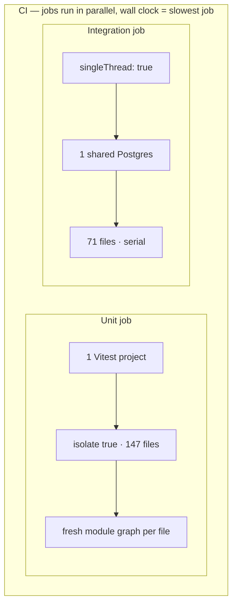
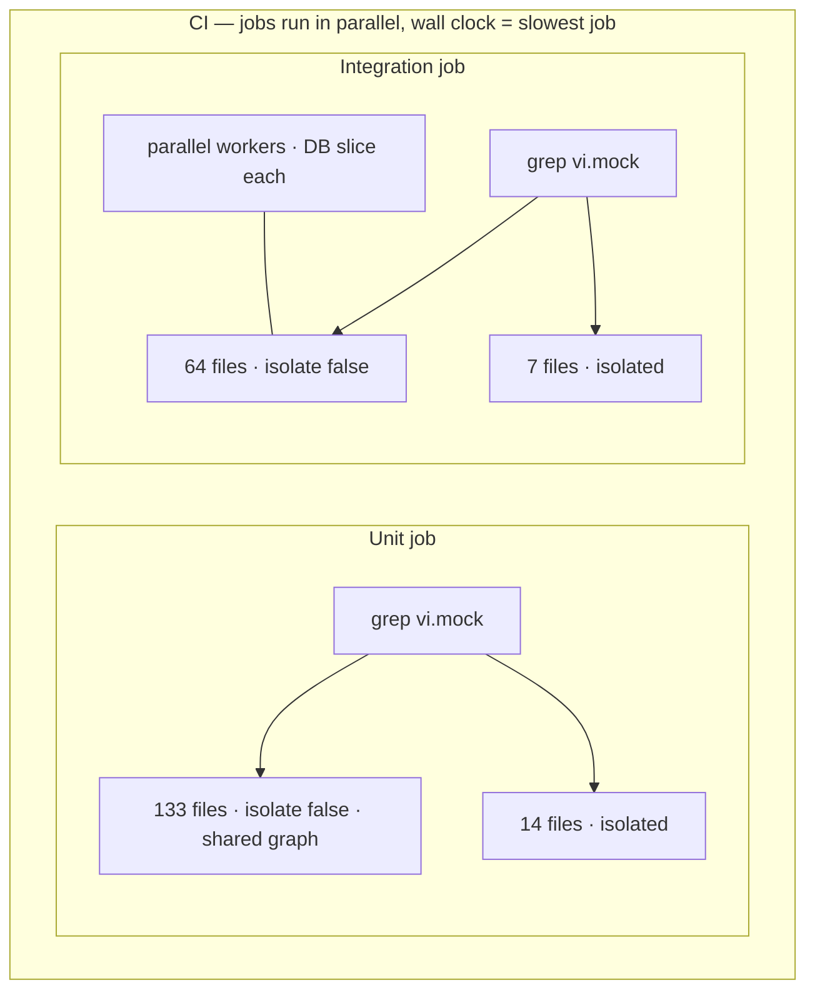

# Vitest at scale: up to 80% faster backend tests

We cut backend integration Vitest time from **266s to 104s** (−61%) and unit Vitest time from **170s to 34s** (−80%) at full stack. The tests were not wrong — we kept rebuilding module graphs and sharing databases that could not safely be shared.

Three changes, applied across both suites where they apply:

1. **Mock split** — grep for `vi.mock`, run non-mock files with `isolate: false`
2. **Worker isolation** — per-worker Postgres, Redis, and DynamoDB for integration tests
3. **SpyOn migration** — replace `vi.mock('@/…')` on our own modules with `vi.spyOn()` (same pattern for unit and integration)

Integration gains come mostly from worker isolation + mock split; spyOn widens the shared pool. Unit gains come mostly from mock split + spyOn.

---

**Summary**

| Suite | Before | After (full stack) | Change |
|-------|--------|-------------------|--------|
| Backend unit (147 files) | **170s** | **34s** | **−80%** |
| Backend integration (71 files / 814 tests) | **266s** | **104s** | **−61%** |
| Wall clock (slowest suite) | **266s** | **104s** | **−61%** |

Benchmark Vitest `Duration`, not the full CI job. Checkout and setup add ~70–110s on top of the test run itself.

Unit speedup comes in two steps:

| Stage | Duration | Isolated files |
|-------|----------|----------------|
| Baseline | 170s | 147 (all isolated) |
| Mock split only | 96s (−43%) | 65 |
| Mock split + spyOn | 34s (−80%) | 14 |

Integration at full stack: **104s** (−61%).

---

## How backend tests run

pnpm + Turbo monorepo, Vitest 4, one CI job per suite.

| Suite | Pattern | Infra |
|-------|---------|-------|
| Unit | `src/**/*.test.ts` | mocks only |
| Integration | `src/**/*.itest.ts` | Testcontainers: Postgres ×2, Redis, DynamoDB Local |

### Before

CI already runs unit and integration as **separate jobs in parallel** — wall clock is whichever job finishes last (integration). The bottleneck was *inside* each job: unit rebuilt a fresh module graph for every file, and integration ran **single-threaded** on one shared Postgres.



### After

Same parallel CI layout. Inside each job: grep-split into shared and isolated Vitest projects. Integration also runs **parallel workers**, each with its own Postgres, Redis, and DynamoDB slice.



File counts above are at **full stack** (mock split + spyOn). Mock split alone shares 82 unit files before spyOn shrinks the isolated bucket to 14.

One `vi.mock()` anywhere in a file sends the whole file to the isolated project. Migrating three of four mocks in a file does nothing for routing.

---

## 1. Mock split: stop paying for isolation you do not need

**Applies to:** unit and integration.

Before: one Vitest project per suite, default `isolate: true`. Every file got a fresh module graph — expensive when ~147 unit files each import most of the backend tree.

After: at config load, grep for `vi.mock` and split into two projects. Files without mocks run with `pool: threads`, `isolate: false`. Files with `vi.mock()` stay isolated so replacements do not leak across tests.

| Suite | Shared | Isolated |
|-------|--------|----------|
| Unit (split only) | 82 | 65 |
| Unit (+ spyOn) | 133 | 14 |
| Integration (+ spyOn) | 64 | 7 |

Also on unit: `disableConsoleIntercept: true` (Vitest 4 teardown workaround), `maxWorkers: cpus().length`.

Mock split alone moved 82 unit files to shared workers (−43% on unit time).

---

## 2. Worker isolation: parallel integration without flakiness

**Applies to:** integration only.

Before: `singleThread: true`, four sequential `globalSetup` files, one shared Postgres, table-by-table truncate on every test.

After: each worker gets its own slice via `test/helpers/worker-isolation.ts`:

| Resource | Per worker |
|----------|------------|
| Postgres | `plumber_test_w{N}` |
| Tiles Postgres | `tiles_test_w{N}` |
| Redis | 4 logical DBs from `REDIS_DB_OFFSET = N × 4` |
| DynamoDB | table suffix `w{N}` |

Containers boot once in `test/global-setup.ts` (`@opengovsg/testcontainers`). `beforeEach` seeds Postgres and flushes Redis. `afterEach` runs batched `TRUNCATE CASCADE` and wipes DynamoDB. `hookTimeout: 120_000` — wiping 10k tile rows after a large itest exceeded Vitest's default 10s hook limit.

`maxWorkers = min(cpus, 32)` (Redis slot cap).

This is most of the integration win. Integration was the wall-clock long pole before and after (**266s → 104s**, −61%).

---

## 3. SpyOn: shrink the isolated bucket

**Applies to:** unit and integration.

`vi.mock('@/…')` on internal code forces a file into the isolated project even when `vi.spyOn()` would work. Replacing those mocks moves the file into the shared pool — same pattern in both suites.

**Integration:** 16 itest files migrated; isolated bucket 23 → 7.

**Unit:** ~51 files migrated; isolated bucket 65 → 14. The remaining ~14 unit files and 7 integration files keep `vi.mock()` for ESM npm packages or import-time dependency graphs.

Shared helpers in `packages/backend/src/test/`:

| Helper | Role |
|--------|------|
| `spy-on-logger.ts` | typed `vi.spyOn(logger, …)` |
| `spy-on-step-query.ts` | Objection `Step.query` chains |
| `stub-apps-registry.ts` | apps registry stubs |

```typescript
import * as auth from '@/helpers/auth'
import { spyOnLogger } from '@/test/spy-on-logger'

beforeEach(() => {
  spyOnLogger({ error: logError })
  vi.spyOn(auth, 'setAuthCookie').mockImplementation(setAuthCookie as never)
})

afterEach(() => vi.clearAllMocks())
```

SpyOn moved another 51 unit files to shared workers (−80% total vs baseline). On integration it widened the shared pool from 48 to 64 files — smaller relative gain because worker isolation already did the heavy lifting.

---

## What we tried — and what to watch for

Dead ends are things we attempted and reverted. Gotchas are things that *work* but will bite the next person who forgets how the setup behaves.

### Approaches we did not ship

| Approach | Why it stopped |
|----------|----------------|
| **Migrate every file off `vi.mock()`** | ~14 unit + 7 integration files need hoisted mocks. ESM packages (`@aws-sdk/*`, `bullmq-pro`, `ai`, `sqs-consumer`, `@opengovsg/formsg-sdk`) and import-time graphs (FormSG triggers, queue/worker init) cannot be spied reliably. |
| **`vi.spyOn()` on worker itests** | Workers capture `exponentialBackoffWithJitter` and `tracer.wrap` at module load. Spies in `beforeEach` run too late — 10 failures in `action.itest.ts`. Reverted to `vi.mock()`. |
| **Dynamic-import workers after spy setup** | Same import-time capture; did not help. |
| **Partial spyOn inside a file** | Config grep routes on any `vi.mock`. One remaining mock keeps the whole file isolated — no partial win. |
| **Replace `@/apps` barrel with direct `formsg` import** | Circular init during module load (`Cannot read properties of undefined (reading 'key')`). |
| **Default 10s `hookTimeout` on DynamoDB wipe** | Post–10k-row tile test, wipe hook timed out. Raised to 120s. |
| **One shared Postgres under parallel workers** | Cross-worker races. Per-worker DB names fixed it. |
| **Per-test DynamoDB table clone** | Too slow. Worker suffix + wipe in `afterEach` is faster and stable. |

### Gotchas for maintainers

| Gotcha | What to do |
|--------|------------|
| **Mock routing is file-level** | Adding `vi.mock()` anywhere in a file sends the entire file to the isolated project. Migrating "most" mocks in a file does nothing for perf. |
| **`isolate: false` leaks mock state** | Shared workers need `vi.clearAllMocks()` / `mockReset()` in `afterEach`. Prefer heavy imports in `beforeAll`. |
| **Worker env must be set before config loads** | Set `POSTGRES_DATABASE`, `REDIS_DB_OFFSET`, and `DYNAMODB_TABLE_SUFFIX` before importing app config — it snapshots env on first load. |
| **Flaky data is often the wrong worker slice** | Debug "wrong row count" by checking whether the test hit another worker's Postgres, Redis, or DynamoDB suffix. |
| **Redis caps parallelism at 32 workers** | Each worker uses 4 logical Redis DBs. `maxWorkers = min(cpus, 32)`. |
| **Large itests need a longer hook timeout** | DynamoDB wipe after big tile tests can exceed 10s. Keep `hookTimeout: 120_000` on integration setup. |
| **Cache skews benchmarks** | A cache hit can make a suite look like it ran in seconds. Benchmark cold runs when comparing changes. |

---

## Takeaways

1. Benchmark Vitest **Duration**, not the full CI job.
2. Baseline against the pre-change setup, not an intermediate optimisation state.
3. **Mock split** both suites: grep at config load, `isolate: false` for files that do not mock.
4. **Worker isolation** for integration: per-worker DB/Redis/Dynamo slices, not one shared Postgres.
5. **SpyOn** both suites: replace `vi.mock('@/…')` on internal modules where you can.
6. Boot containers once; truncate, flush, and wipe per test.
7. Plan mock migrations file-by-file. One remaining `vi.mock()` keeps the file isolated.

Unit drops **170s → 34s** (−80%) when mock split and spyOn both land. Integration drops **266s → 104s** (−61%) when all three changes land.
