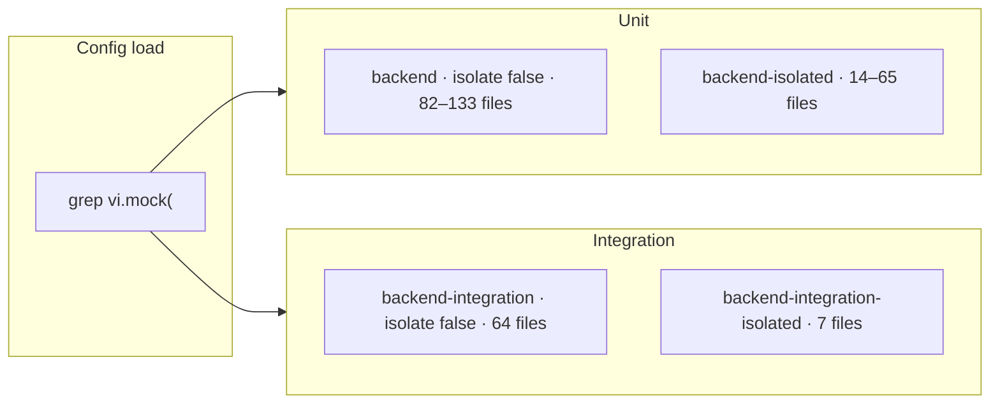

# Vitest at scale: up to 80% faster backend tests

We cut backend integration Vitest time from **266s to 104s** (−61%) and unit Vitest time from **170s to 34s** (−80%) at full stack. The tests were not wrong — we kept rebuilding module graphs and sharing databases that could not safely be shared.

The work stacks in two parts: parallel integration (worker isolation + integration spyOn) and unit tests (mock split + unit spyOn).

---

**Summary**

| Suite | Before | After (full stack) | Change |
|-------|--------|-------------------|--------|
| Backend unit (147 files) | **170s** Vitest · **176s** turbo | **34s** · **39s** | **−80% / −78%** |
| Backend integration (71 files / 814 tests) | **266s** · **276s** | **104s** · **110s** | **−61% / −60%** |
| Wall clock (slowest backend job) | **276s** | **110s** | **−60%** |

Benchmark the **turbo test step** (`pnpm exec turbo run test:* --filter=backend`), not the full CI job. Checkout and Datadog setup add ~70–110s per job on top. Vitest `Duration` is the line inside the turbo step.

Unit speedup comes in two steps:

| Stage | Vitest · turbo | Isolated files |
|-------|----------------|----------------|
| Baseline | 170s · 176s | 147 (all isolated) |
| Mock split only | 96s · 101s (−43%) | 65 |
| Mock split + spyOn | 34s · 39s (−80%) | 14 |

Integration at full stack: **104s · 110s** turbo (−61%).

---

## How backend tests run

pnpm + Turbo monorepo, Vitest 4, one CI job per suite.

| Suite | Pattern | Infra |
|-------|---------|-------|
| Unit | `src/**/*.test.ts` | mocks only |
| Integration | `src/**/*.itest.ts` | Testcontainers: Postgres ×2, Redis, DynamoDB Local |

Both configs grep for `vi.mock(` at load time and split into two Vitest projects. Files without mocks run with `isolate: false`; anything that still calls `vi.mock()` stays isolated.



One `vi.mock()` anywhere in a file sends the whole file to the isolated project. Migrating three of four mocks in a file does nothing for routing.

---

## Layer 1: turn off isolation where mocks do not force it

### Unit

Before: one Vitest project, default `isolate: true`. Every file got a fresh module graph — expensive when ~147 files each import most of the backend tree.

After: two projects in `vitest.config.ts`. Non-mock files share one graph per worker (`pool: threads`, `isolate: false`). Mock files stay isolated so replacements do not leak across tests.

Also: `disableConsoleIntercept: true` (Vitest 4 teardown workaround), `maxWorkers: cpus().length`.

### Integration

Before: `singleThread: true`, four sequential `globalSetup` files, one shared Postgres, table-by-table truncate on every test.

After: each worker gets its own slice via `test/helpers/worker-isolation.ts`:

| Resource | Per worker |
|----------|------------|
| Postgres | `plumber_test_w{N}` |
| Tiles Postgres | `tiles_test_w{N}` |
| Redis | 4 logical DBs from `REDIS_DB_OFFSET = N × 4` |
| DynamoDB | table suffix `w{N}` |

Containers boot once in `test/global-setup.ts` (`@opengovsg/testcontainers`). `beforeEach` seeds Postgres and flushes Redis. `afterEach` runs batched `TRUNCATE CASCADE` and wipes DynamoDB. `hookTimeout: 120_000` — wiping 10k tile rows after a large itest exceeded Vitest's default 10s hook limit.

`maxWorkers = min(cpus, 32)` (Redis slot cap). Same mock split: **64 shared / 7 isolated** itests (was 48 / 23).

---

## Layer 2: `vi.spyOn()` for our own modules

`vi.mock('@/…')` on internal code still forces isolation even though `vi.spyOn()` would work. Replacing those mocks moves files into the shared pool.

**Integration:** 16 itest files migrated; isolated bucket 23 → 7.

**Unit:** ~51 files migrated; isolated bucket 65 → 14. The remaining ~14 unit files and 7 integration files keep `vi.mock()` for ESM npm packages or import-time dependency graphs.

Helpers in `packages/backend/src/test/`:

| Helper | Role |
|--------|------|
| `spy-on-logger.ts` | typed `vi.spyOn(logger, …)` |
| `spy-on-step-query.ts` | Objection `Step.query` chains |
| `stub-apps-registry.ts` | apps registry stubs |

```typescript
import * as auth from '@/helpers/auth'
import { spyOnLogger } from '@/test/spy-on-logger'

beforeEach(() => {
  spyOnLogger({ error: logError })
  vi.spyOn(auth, 'setAuthCookie').mockImplementation(setAuthCookie as never)
})

afterEach(() => vi.clearAllMocks())
```

Mock split alone moved 82 files to shared workers (−43%). SpyOn moved another 51 (−80% total vs baseline). Integration gains are mostly parallelism + infra; spyOn widened the shared integration pool from 48 to 64 files.

---

## What we tried and did not ship

| Approach | Why it stopped |
|----------|----------------|
| **Migrate every file off `vi.mock()`** | ~14 unit + 7 integration files need hoisted mocks. ESM packages (`@aws-sdk/*`, `bullmq-pro`, `ai`, `sqs-consumer`, `@opengovsg/formsg-sdk`) and import-time graphs (FormSG triggers, queue/worker init) cannot be spied reliably. |
| **`vi.spyOn()` on worker itests** | Workers capture `exponentialBackoffWithJitter` and `tracer.wrap` at module load. Spies in `beforeEach` run too late — 10 failures in `action.itest.ts`. Reverted to `vi.mock()`. |
| **Dynamic-import workers after spy setup** | Same import-time capture; did not help. |
| **Partial spyOn inside a file** | Grep routing sees any `vi.mock(`. One remaining mock keeps the file isolated. |
| **Replace `@/apps` barrel with direct `formsg` import** | Circular init during module load (`Cannot read properties of undefined (reading 'key')`). |
| **Default 10s `hookTimeout` on DynamoDB wipe** | Post–10k-row tile test, wipe hook timed out. Raised to 120s. |
| **One shared Postgres under parallel workers** | Cross-worker races. Per-worker DB names fixed it. |
| **Per-test DynamoDB table clone** | Too slow. Worker suffix + wipe in `afterEach` is faster and stable. |

---

## What got harder

**Shared workers need mock cleanup.** With `isolate: false`, mock state persists. We rely on `vi.clearAllMocks()` / `mockReset()` in `afterEach`, heavy imports in `beforeAll`, and higher timeouts where tests assumed serial execution.

**Worker isolation is real infrastructure.** Flaky data often means the wrong worker's Postgres/Redis/Dynamo slice, or hitting the 32-worker Redis cap. Set `POSTGRES_DATABASE`, `REDIS_DB_OFFSET`, and `DYNAMODB_TABLE_SUFFIX` before app config imports — config snapshots env on first load.

---

## Takeaways

1. Benchmark the turbo **test step**, not the job total.
2. Baseline against the pre-change setup, not an intermediate optimisation state.
3. Grep-split at config load: turn off isolation for files that do not mock.
4. Replace `vi.mock('@/…')` with `vi.spyOn()` where you can — that shrinks the isolated bucket more than worker tuning.
5. Parallel integration needs per-worker DB/Redis/Dynamo slices, not one shared Postgres.
6. Boot containers once; truncate, flush, and wipe per test.
7. Plan mock migrations file-by-file. One remaining `vi.mock()` keeps the file isolated.

Integration is the wall-clock long pole (**276s → 110s**, −60%). Unit drops **176s → 39s** (−78% turbo) when both layers land.
