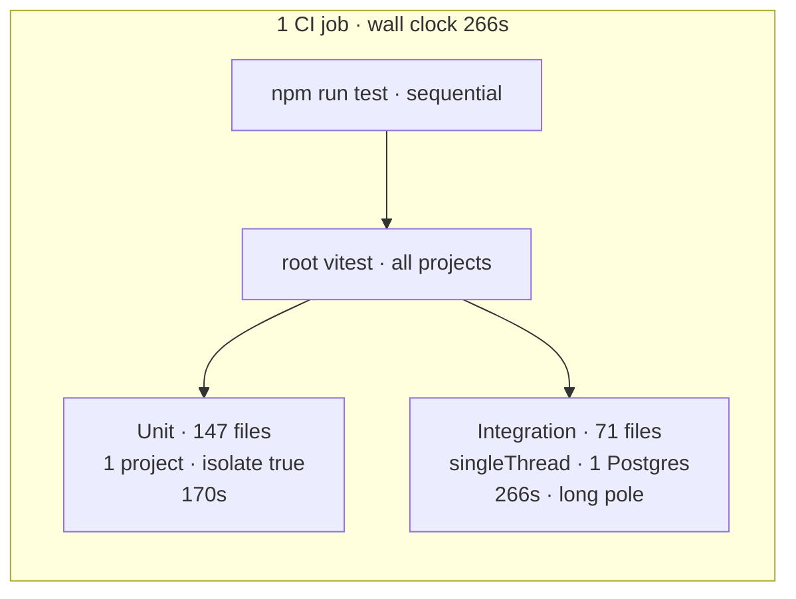
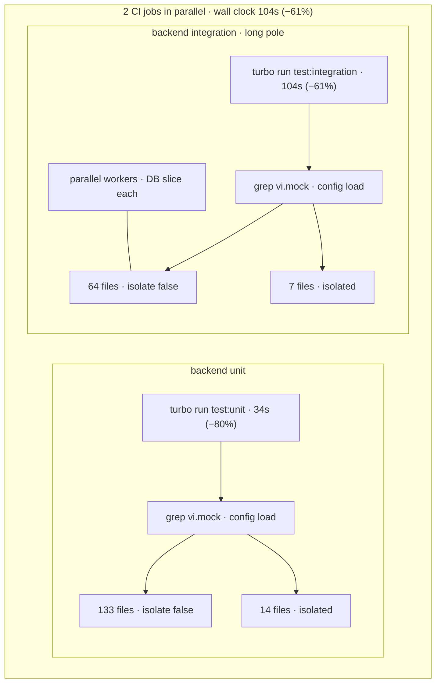
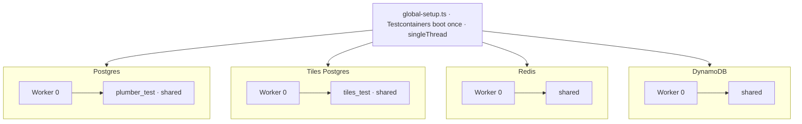
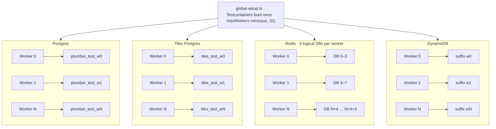

# Vitest at scale: up to 80% faster backend tests

We cut backend integration Vitest time from **266s to 104s** (−61%) and unit Vitest time from **170s to 34s** (−80%) at full stack. The tests were not wrong — we kept rebuilding module graphs and sharing databases that could not safely be shared.

Three changes, applied across both suites where they apply:

1. **Worker isolation** — per-worker Postgres, Redis, and DynamoDB for integration tests
2. **Mock split** — grep for `vi.mock`, run non-mock files with `isolate: false`
3. **SpyOn migration** — replace `vi.mock('@/…')` on our own modules with `vi.spyOn()` (same pattern for unit and integration)

Integration gains come mostly from worker isolation + mock split; spyOn widens the shared pool. Unit gains come mostly from mock split + spyOn.

---

**Summary**

| Suite | Before (develop-v2) | After (full stack) | Change |
|-------|--------|-------------------|--------|
| Backend unit (147 files) | **170s** | **34s** | **−80%** |
| Backend integration (71 files / 814 tests) | **266s** | **104s** | **−61%** |
| Wall clock (slowest suite) | **266s** | **104s** | **−61%** |

Benchmark Vitest `Duration` per suite. To compare unit and integration separately, each suite runs in its own CI job via `turbo run test:unit` or `test:integration`. On develop-v2, both ran in **one CI job** (`npm run test`) — the table below uses the split-job timing with develop-v2's Vitest config as the baseline.

Unit speedup comes in two steps:

| Stage | Duration | Isolated files |
|-------|----------|----------------|
| Baseline | 170s | 147 (all isolated) |
| Mock split only | 96s (−43%) | 65 |
| Mock split + spyOn | 34s (−80%) | 14 |

Integration at full stack: **104s** (−61%).

---

## How backend tests run

Unit tests mock dependencies; integration tests hit Postgres (×2), Redis, and DynamoDB Local via Testcontainers. The diagrams below show how CI ran them before and after.

### Before (develop-v2)

**One CI job** runs `npm run test` — a single root Vitest invocation that includes backend unit and integration (plus frontend) back-to-back. Backend used one Vitest project per suite, with no mock split and no per-worker databases.



### After (full stack)

**Two CI jobs in parallel**, each via turbo — so unit and integration are timed independently and wall clock is the slower job (integration).



Inside each job: grep-split into shared and isolated Vitest projects. Mock split alone shares 82 unit files before spyOn shrinks the isolated bucket to 14.

One `vi.mock()` anywhere in a file sends the whole file to the isolated project. Migrating three of four mocks in a file does nothing for routing.

---

## 1. Worker isolation: parallel integration without flakiness

**Applies to:** integration only.

Before (develop-v2): `singleThread: true`, four sequential `globalSetup` files, one shared Postgres, table-by-table truncate on every test.

After: each worker gets its own slice via `test/helpers/worker-isolation.ts`:

| Resource | Per worker |
|----------|------------|
| Postgres | `plumber_test_w{N}` |
| Tiles Postgres | `tiles_test_w{N}` |
| Redis | 4 logical DBs from `REDIS_DB_OFFSET = N × 4` |
| DynamoDB | table suffix `w{N}` |

**Why Redis is different:** Postgres, Tiles Postgres, and DynamoDB each get a per-worker *name* — a new database or table suffix. Redis is one shared container; isolation is by **logical DB index**, not by spinning up another Redis. The app uses four Redis DBs per process (jobs, rate limit, pipe errors, app data), so worker `N` gets indices `N×4` through `N×4+3` via `REDIS_DB_OFFSET`. Testcontainers starts Redis with 256 logical DBs. With four indices per worker and two integration Vitest projects (shared + isolated from mock split), that caps parallelism at **32 workers** — hence `maxWorkers = min(cpus, 32)`.

### Before



### After



Containers boot once in `test/global-setup.ts` (`@opengovsg/testcontainers`). `beforeEach` seeds Postgres and flushes Redis. `afterEach` runs batched `TRUNCATE CASCADE` and wipes DynamoDB. `hookTimeout: 120_000` — wiping 10k tile rows after a large itest exceeded Vitest's default 10s hook limit.

This is most of the integration win. Integration was the wall-clock long pole before and after (**266s → 104s**, −61%).

---

## 2. Mock split: stop paying for isolation you do not need

**Applies to:** unit and integration.

Before (develop-v2): one Vitest project per suite, default `isolate: true`. Every file got a fresh module graph — expensive when ~147 unit files each import most of the backend tree.

After: at config load, grep for `vi.mock` and split into two projects. Files without mocks run with `pool: threads`, `isolate: false`. Files with `vi.mock()` stay isolated so replacements do not leak across tests.

| Suite | Shared | Isolated |
|-------|--------|----------|
| Unit (split only) | 82 | 65 |
| Unit (+ spyOn) | 133 | 14 |
| Integration (+ spyOn) | 64 | 7 |

Also on unit: `maxWorkers: cpus().length`.

Mock split alone moved 82 unit files to shared workers (−43% on unit time).

---

## 3. SpyOn: shrink the isolated bucket

**Applies to:** unit and integration.

`vi.mock('@/…')` on internal code forces a file into the isolated project even when `vi.spyOn()` would work. Replacing those mocks moves the file into the shared pool — same pattern in both suites.

**Integration:** 16 itest files migrated; isolated bucket 23 → 7.

**Unit:** ~51 files migrated; isolated bucket 65 → 14. The remaining ~14 unit files and 7 integration files keep `vi.mock()` for ESM npm packages or import-time dependency graphs.

Shared helpers in `packages/backend/src/test/`:

| Helper | Role |
|--------|------|
| `spy-on-logger.ts` | typed `vi.spyOn(logger, …)` |
| `spy-on-step-query.ts` | Objection `Step.query` chains |
| `stub-apps-registry.ts` | apps registry stubs |

```typescript
import * as auth from '@/helpers/auth'
import { spyOnLogger } from '@/test/spy-on-logger'

beforeEach(() => {
  spyOnLogger({ error: logError })
  vi.spyOn(auth, 'setAuthCookie').mockImplementation(setAuthCookie as never)
})

afterEach(() => vi.clearAllMocks())
```

SpyOn moved another 51 unit files to shared workers (−80% total vs baseline). On integration it widened the shared pool from 48 to 64 files — smaller relative gain because worker isolation already did the heavy lifting.

---

## What we tried — and what to watch for

Most of the win came from the three config changes above, not from eliminating every mock or parallelizing naively. Below: what we tried and reverted, integration approaches that failed before worker isolation shipped, and constraints to follow when adding or debugging tests.

### Mock and spyOn dead ends

These looked like easy follow-ons after mock split and spyOn migrations. Each one either failed in CI or would not have moved Vitest Duration further.

#### Migrate every file off `vi.mock()`

- **What we tried:** replace every `vi.mock()` with `vi.spyOn()` so no file needs the isolated project.
- **Why it fails:** `vi.mock()` is *hoisted* — Vitest applies it before your test file imports anything. That matters for npm ESM packages (`@aws-sdk/*`, `bullmq-pro`, `ai`, …) and for our own code that sets up queues, workers, or FormSG triggers as soon as the file loads. `vi.spyOn()` runs later, after the real module is already in memory, so it cannot stand in for “fake this dependency before the first import.”
- **Outcome:** **14 unit + 7 integration** files still need `vi.mock()` (Summary table above). Migrating those would be a lot of rework for zero extra speed — they stay in the isolated bucket by design. Migrate file-by-file where spyOn works; stop when you hit import-time graphs.

#### `vi.spyOn()` on worker itests

- **What we tried:** worker integration tests mock helpers like `exponentialBackoffWithJitter` and `tracer.wrap`. We replaced `vi.mock()` with `vi.spyOn()` in `beforeEach` so those files could join the shared pool.
- **Why it fails:** worker code grabs those functions when the module *loads*, not when each test runs. By the time `beforeEach` installs a spy, the worker has already captured the real implementations. Tests call the unmocked behaviour — **`action.itest.ts` failed 10 tests**. Loading the worker with `import()` after spy setup did not help; the same bindings happen on load.
- **Outcome:** worker itests keep `vi.mock()` and stay in the isolated project. Perf win there comes from mock split + worker isolation, not from spyOn on those files.

#### Partial spyOn cleanup in one file

- **What we tried:** a file with four `vi.mock()` calls — migrate three to spyOn, leave one, hope for most of the benefit.
- **Why it fails:** mock split does not count “how many mocks remain.” It greps the file for any `vi.mock` string. One left → whole file still runs in the isolated project with a fresh module graph every time — same cost as four mocks. The After diagram above shows the split; routing is all-or-nothing per file.
- **Outcome:** no Duration win until the last `vi.mock()` in that file is gone. Partial cleanup is fine for readability, not for benchmarks.

#### Replace `@/apps` barrel with a direct `formsg` import

- **What we tried:** during spyOn migrations, import `formsg` directly instead of through `@/apps` so we could drop a barrel-level mock.
- **Why it fails:** `@/apps` and the FormSG modules initialize each other during load. Pulling `formsg` in directly hit a half-built module graph — crash: `Cannot read properties of undefined (reading 'key')`.
- **Outcome:** kept the barrel and `vi.mock()` for that graph. Some dependency trees are not worth untangling for test speed.

### Integration infra dead ends

We tried these while parallelizing integration tests. None worked. Worker isolation (above) is what shipped instead.

- **One shared Postgres under parallel workers** — cross-worker races on truncate and inserts.
- **Per-test DynamoDB table clone** — correct isolation, too slow at our test volume.
- **Default 10s `hookTimeout` on DynamoDB wipe** — timed out after a ~10k-row tile itest.

### When you add or change tests

Rules the shipped config assumes — break them and tests leak mock state or hit the wrong database slice.

#### `isolate: false` leaks mock state

- **What breaks:** a spy or mock set up in test A (e.g. `mockReturnValue`, `mockImplementation`) is still active when test B runs.
- **Why:** mock-split files share one Node worker that loads each module once and reuses the graph across tests.
- **What to do:** call `vi.clearAllMocks()` or `mockReset()` in `afterEach`; put heavy `import`s in `beforeAll` where you can.

#### Worker env before config loads

- **What breaks:** every Vitest worker reads and writes the same Postgres, Redis block, and DynamoDB suffix — wrong rows, cross-test pollution.
- **Why:** app config reads `POSTGRES_DATABASE`, `REDIS_DB_OFFSET`, and `DYNAMODB_TABLE_SUFFIX` on first import and keeps those values for the process lifetime.
- **What to do:** let `test/helpers/worker-isolation.ts` set env per worker before any app or config module imports; do not pull app code in early or skip the isolation hook.

#### Redis caps at 32 workers

- **What breaks:** workers share Redis logical DB indices — queue and cache keys collide across parallel itests.
- **Why:** each worker needs four contiguous indices; mock split runs two integration Vitest projects (shared + isolated): 256 ÷ 4 ÷ 2 = **32** slots (see worker isolation above).
- **What to do:** keep `maxWorkers = min(cpus, 32)` unless you change Redis logical DB count or drop back to one integration project.

---

## In short

If you are copying this work, roll it out in a different order from how we told the story above.

Start with **mock split** — it is config-only. Grep for `vi.mock` at load time and run everything else with `isolate: false`. No test rewrites required. On our unit suite, that step alone dropped **170s to 96s** (−43%).

For integration, add **worker isolation** next: per-worker Postgres, Redis, and DynamoDB slices *before* you raise `maxWorkers`. When we parallelized on one shared Postgres, tests flaked from cross-worker data races — not from slow assertions.

**SpyOn** comes last, file by file, once the split is live. You will eventually hit a tail of ~20 files that still need hoisted `vi.mock()`; beyond that, migration effort stops moving Duration. Do not lead with mock migrations, eliminating every mock, or tuning worker count without isolation — see [what we tried](#what-we-tried--and-what-to-watch-for) above for what we reverted.

When you measure your own changes, compare Vitest **Duration** per suite on a cold run against a stable baseline. CI wall clock and Turbo cache hits will not tell you whether the config change worked.
