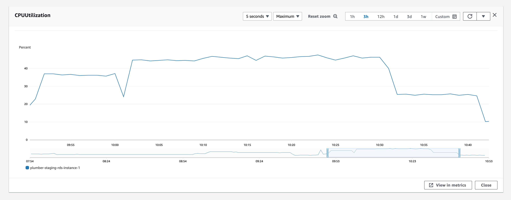

## Load testing with K6

### To run

`brew install grafana/k6`
then
`k6 run formsg.js`

### To run with dashboard

`./k6 run --out dashboard=open webhook.js`

### Testing incoming FormSG Webhook

- Make a formsg submissions, and copy the ecrypted data and formsg signature from the logs
- Paste it in formsg.js and run the test

## Results

### After query optimization

Running on workflow (raw webhook -> mock api request)

Constant rate: 80/s

Dequeuing with 4 workers

RDS: db.r6g.large

`./k6 run --out dashboard=open webhook.js`

```

          /\      |‾‾| /‾‾/   /‾‾/
     /\  /  \     |  |/  /   /  /
    /  \/    \    |     (   /   ‾‾\
   /          \   |  |\  \ |  (‾)  |
  / __________ \  |__| \__\ \_____/ .io

  execution: local
     script: webhook.js
     output: dashboard (:5665) http://127.0.0.1:5665

  scenarios: (100.00%) 1 scenario, 50 max VUs, 30m30s max duration (incl. graceful stop):
           * contacts: 80.00 iterations/s for 30m0s (maxVUs: 2-50, gracefulStop: 30s)

WARN[0001] Insufficient VUs, reached 50 active VUs and cannot initialize more  executor=constant-arrival-rate scenario=contacts

     ✓ 0
     ✓ 1
     ✓ 2
     ✓ 3
     ✓ 4
     ✓ 5
     ✓ 6
     ✓ 7
     ✓ 8
     ✓ 9
     ✓ 10

     checks.........................: 100.00% ✓ 1566257   ✗ 0
     data_received..................: 74 MB   41 kB/s
     data_sent......................: 14 MB   7.6 kB/s
     dropped_iterations.............: 1614    0.896638/s
     http_req_blocked...............: avg=29.65µs  min=0s      med=1µs     max=203.06ms p(90)=2µs      p(95)=3µs
     http_req_connecting............: avg=13.44µs  min=0s      med=0s      max=168.47ms p(90)=0s       p(95)=0s
     http_req_duration..............: avg=87.1ms   min=19.21ms med=40.55ms max=1.31s    p(90)=194.51ms p(95)=266.54ms
       { expected_response:true }...: avg=87.1ms   min=26.97ms med=40.55ms max=1.31s    p(90)=194.51ms p(95)=266.54ms
     http_req_failed................: 0.00%   ✓ 7         ✗ 142380
     http_req_receiving.............: avg=326.08µs min=9µs     med=120µs   max=159.17ms p(90)=393µs    p(95)=988µs
     http_req_sending...............: avg=469.54µs min=22µs    med=324µs   max=71.91ms  p(90)=711µs    p(95)=1.11ms
     http_req_tls_handshaking.......: avg=13.14µs  min=0s      med=0s      max=181.64ms p(90)=0s       p(95)=0s
     http_req_waiting...............: avg=86.31ms  min=9.61ms  med=39.82ms max=1.31s    p(90)=193.62ms p(95)=265.3ms
     http_reqs......................: 142387  79.101323/s
     iteration_duration.............: avg=88.02ms  min=19.65ms med=41.54ms max=1.31s    p(90)=195.64ms p(95)=267.71ms
     iterations.....................: 142387  79.101323/s
     vus............................: 4       min=2       max=50
     vus_max........................: 50      min=37      max=50


running (30m00.1s), 00/50 VUs, 142387 complete and 0 interrupted iterations
contacts ✓ [======================================] 00/50 VUs  30m0s  80.00 iters
```

RDS CPU usage:
hovers at around 46% consistently



<details>
<summary><h2 style="display: inline">Old Results</h2></span></summary>

- On average, with 30 vus running for 30s
- 5 running ecs task (1vCPU) can handle about 50+ req/s with CPU under 50%, and RDS CPU maxing out

```

          /\      |‾‾| /‾‾/   /‾‾/
     /\  /  \     |  |/  /   /  /
    /  \/    \    |     (   /   ‾‾\
   /          \   |  |\  \ |  (‾)  |
  / __________ \  |__| \__\ \_____/ .io

  execution: local
     script: formsg.js
     output: -

  scenarios: (100.00%) 1 scenario, 30 max VUs, 1m0s max duration (incl. graceful stop):
           * default: 30 looping VUs for 30s (gracefulStop: 30s)

     checks.........................: 100.00% ✓ 19162     ✗ 0
     data_received..................: 1.1 MB  35 kB/s
     data_sent......................: 4.8 MB  157 kB/s
     http_req_blocked...............: avg=7.67ms   min=0s      med=1µs      max=528.19ms p(90)=2µs      p(95)=2µs
     http_req_connecting............: avg=310.45µs min=0s      med=0s       max=18.72ms  p(90)=0s       p(95)=0s
     http_req_duration..............: avg=511.86ms min=95.18ms med=496.3ms  max=1.14s    p(90)=720.98ms p(95)=816.13ms
       { expected_response:true }...: avg=511.86ms min=95.18ms med=496.3ms  max=1.14s    p(90)=720.98ms p(95)=816.13ms
     http_req_failed................: 0.00%   ✓ 0         ✗ 1742
     http_req_receiving.............: avg=137.95µs min=12µs    med=73µs     max=7.88ms   p(90)=135.9µs  p(95)=314.89µs
     http_req_sending...............: avg=155.06µs min=20µs    med=118.5µs  max=19.14ms  p(90)=202µs    p(95)=250.94µs
     http_req_tls_handshaking.......: avg=6.79ms   min=0s      med=0s       max=476.78ms p(90)=0s       p(95)=0s
     http_req_waiting...............: avg=511.57ms min=94.87ms med=495.81ms max=1.14s    p(90)=720.67ms p(95)=815.95ms
     http_reqs......................: 1742    57.431666/s
     iteration_duration.............: avg=519.96ms min=95.54ms med=496.5ms  max=1.56s    p(90)=721.68ms p(95)=819.81ms
     iterations.....................: 1742    57.431666/s
     vus............................: 30      min=30      max=30
     vus_max........................: 30      min=30      max=30
```

### Testing worker job completion rate

`k6 run webhook.js`

- Test pipe: 1 incoming webhook to 1 outgoing webhook to https://mock.codes/200
- 5 running ecs tasks (1vCPU) can handle about 230 req/s

```
          /\      |‾‾| /‾‾/   /‾‾/
     /\  /  \     |  |/  /   /  /
    /  \/    \    |     (   /   ‾‾\
   /          \   |  |\  \ |  (‾)  |
  / __________ \  |__| \__\ \_____/ .io

  execution: local
     script: webhook.js
     output: -

  scenarios: (100.00%) 1 scenario, 50 max VUs, 1m0s max duration (incl. graceful stop):
           * default: 50 looping VUs for 30s (gracefulStop: 30s)


     ✓ 0
     ✓ 1
     ✓ 2
     ✓ 3
     ✓ 4
     ✓ 5
     ✓ 6
     ✓ 7
     ✓ 8
     ✓ 9
     ✓ 10

     checks.........................: 100.00% ✓ 76747      ✗ 0
     data_received..................: 3.8 MB  126 kB/s
     data_sent......................: 3.5 MB  114 kB/s
     http_req_blocked...............: avg=611.15µs min=0s      med=1µs      max=135.22ms p(90)=1µs      p(95)=1µs
     http_req_connecting............: avg=150.74µs min=0s      med=0s       max=22.82ms  p(90)=0s       p(95)=0s
     http_req_duration..............: avg=214.73ms min=60.46ms med=202.45ms max=1.4s     p(90)=300.19ms p(95)=343.93ms
       { expected_response:true }...: avg=214.73ms min=60.46ms med=202.45ms max=1.4s     p(90)=300.19ms p(95)=343.93ms
     http_req_failed................: 0.00%   ✓ 0          ✗ 6977
     http_req_receiving.............: avg=330.97µs min=9µs     med=56µs     max=244.18ms p(90)=147µs    p(95)=1.1ms
     http_req_sending...............: avg=109.8µs  min=13µs    med=80µs     max=23.16ms  p(90)=150µs    p(95)=201µs
     http_req_tls_handshaking.......: avg=448.8µs  min=0s      med=0s       max=111.13ms p(90)=0s       p(95)=0s
     http_req_waiting...............: avg=214.29ms min=60.31ms med=201.99ms max=1.4s     p(90)=299.8ms  p(95)=343.48ms
     http_reqs......................: 6977    231.158802/s
     iteration_duration.............: avg=215.63ms min=60.76ms med=202.73ms max=1.51s    p(90)=300.6ms  p(95)=344.19ms
     iterations.....................: 6977    231.158802/s
     vus............................: 50      min=50       max=50
     vus_max........................: 50      min=50       max=50


running (0m30.2s), 00/50 VUs, 6977 complete and 0 interrupted iterations
```

</details>
